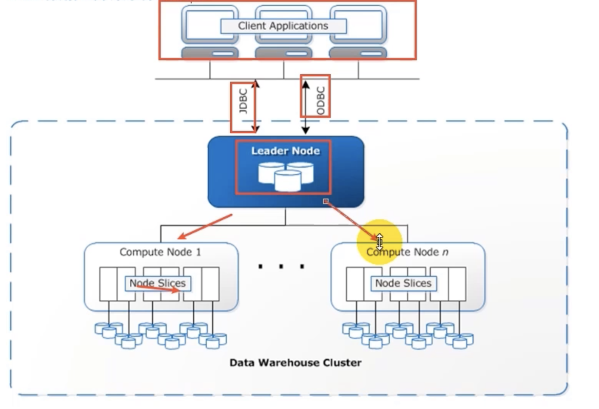

### Redshift架构概述

1. 客户端应用程序
postgreSQL的JDBC

2. 集群节点--master 
3. 计算节点--worker 

节点切片。
PostgreSQL 8.0.2 

### 性能概述

大规模分布式并行计算

列式数据存储

数据压缩  

结果缓存 

SVL_QLOG 查看查询的history 

### 列式存储概念
单列更适合分布式存储
同一列放在一起，数据类型相同，更好压缩
基于排序更方便，更快

